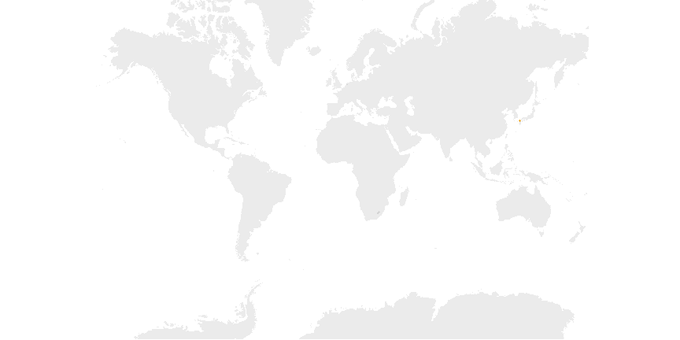

```{r setup, include=FALSE}
options(htmltools.dir.version = FALSE)
knitr::opts_chunk$set(eval = TRUE)
knitr::opts_chunk$set(fig.width=12, fig.height=6) 
```

# What is Tidy Tuesday?

https://github.com/rfordatascience/tidytuesday
---

# I want to learn about maps and animation! What about meteorites?

https://www.theguardian.com/news/datablog/interactive/2013/feb/15/meteorite-fall-map
---

# Meteorites data has space and time!
```{r, data, message = FALSE}
library(tidyverse)
library(maps)
library(gganimate)

meteorites <- readr::read_csv("meteorites.csv") %>% 
  tidyr::drop_na() %>% dplyr::filter(geolocation != '(0.0, 0.0)')
```
```{r table, echo = FALSE}
meteorites %>% head() %>% select(-geolocation) %>% knitr::kable(format='html')
```
https://raw.githubusercontent.com/rfordatascience/tidytuesday/master/data/2019/2019-06-11/meteorites.csv

---

# Start with good old ggplot
```{r, points}
points <- ggplot() + geom_point(data = meteorites, 
  aes(x = long, y = lat, size = mass), color = 'orange', show.legend = F)
```
```{r, points_out, echo = FALSE}
points
```

---

# First map! ... not exactly right?!
https://ggplot2.tidyverse.org/reference/map_data.html

```{r, first_map}
points_on_map  <- points + geom_polygon(data = map_data("world"), 
  aes(x=long, y=lat, group=group),
  fill="grey", alpha=0.3) + coord_map() + theme_void()
```
```{r, first_map_out, echo = FALSE}
points_on_map
```
---

# ..but simple fix to xlim will do :)
```{r, better_map}
points_on_map  <- points + geom_polygon(data = map_data("world"), 
  aes(x=long, y=lat, group=group),
  fill="grey", alpha=0.3) + coord_map(xlim = c(-180, 180)) + theme_void()
```
```{r, better_map_out, echo = FALSE}
points_on_map
```
https://github.com/tidyverse/ggplot2/issues/1104
---
class:inverse, center, middle
# Animate!
https://gganimate.com/

---
# My first animation!
```{r, first-animation}
meteorites_animation <- points +
  transition_time(year) +
  shadow_mark(past = TRUE, future = FALSE)
```
```{r, first_animation_out, include = FALSE, eval = params$create_animations}
meteorites_animation
```

..but why are the points moving around like that?
---

# aes(group = year) makes sure we don't animate between years!
>The group aesthetic defines how the data in a layer is matched across the animation. https://gganimate.com/

```{r, group-points}
points <- ggplot() + geom_point(data = meteorites, 
  aes(x = long, y = lat, size = mass, group = year), #<<
  color = 'orange', show.legend = F)
```
---
# aes(group = year) makes sure we don't animate between years!
```{r, group-points2}
meteorites_animation <- points +
  transition_time(year) +
  shadow_mark(past = TRUE, future = FALSE)
```
```{r, group_points_out, include = FALSE, eval = params$create_animations}
meteorites_animation
```


---

# Focus the animation to the years that matter!

```{r, focus}
meteorites_animation <- points +
  transition_time(year, range = c(1930, 2013)) +
  shadow_mark(past = TRUE, future = FALSE)
```
```{r, focus_out, include = FALSE, eval = params$create_animations}
meteorites_animation
```


---

# Map + Animation = <3

```{r, include = F}
points_on_map <- points + geom_polygon(data = map_data("world"),
  aes(x=long, y = lat, group = group), fill="grey", alpha=0.3) + 
  coord_map(xlim = c(-180, 180)) + theme_void()
```
```{r, map_4min}
# Remember to re-run points_on_map code after adding the group (hidden)
meteorites_animation <- points_on_map +
  transition_time(year, range = c(1930, 2013)) +
  shadow_mark(past = TRUE, future = FALSE)
```
```{r, map_4min_out, include = FALSE, eval = params$create_animations}
meteorites_animation
```

..but it does take several minutes to render
---

# Reduce render time using nframes and voila!
```{r, final, eval = params$create_animations}
animate(meteorites_animation, nframes = 40, end_pause = 10, duration = 10)
```


---


class:inverse, center, middle

# Please come back 3rd of Desember!
https://www.meetup.com/rladies-oslo/events/264701504/
